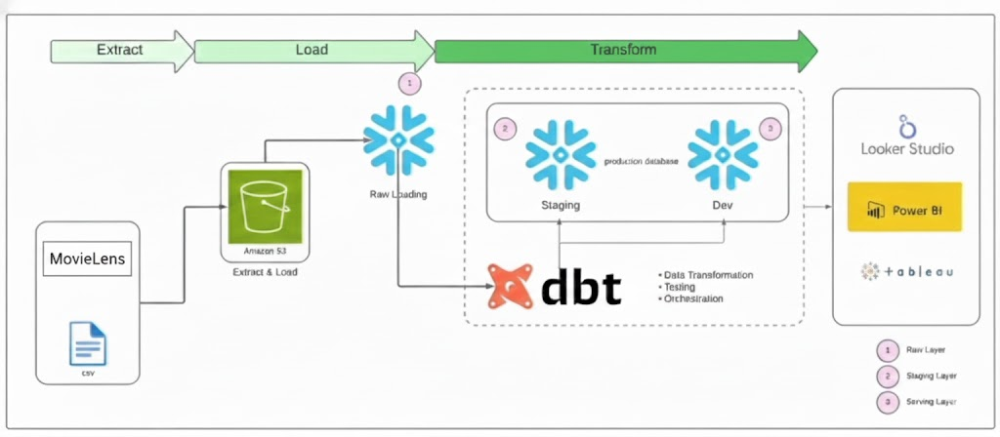

# 🎬 MovieLens Analytics Pipeline: ELT with dbt & Snowflake


## 📖 Overview

This project implements a modern **ELT (Extract, Load, Transform)** data pipeline designed to analyze the MovieLens dataset. By leveraging **Snowflake** for data warehousing and **dbt (data build tool)** for transformation, this pipeline turns raw CSV data into structured, analytics-ready dimensional models suitable for BI tools like Power BI, Tableau, or Looker.

## 🏗 Architecture


*High-level Data Flow Diagram*

The pipeline follows a layered architecture pattern:

1.  **Extract & Load:** Raw CSV data (Movies, Ratings, Tags, etc.) is onboarded from local sources/S3 into **Snowflake**.
2.  **Raw Layer:** Data lands in the `RAW` schema in its original format.
3.  **Transformation (dbt):**
    * **Staging Layer:** Cleaning, type casting, and column renaming (e.g., `movieId` → `movie_id`) to ensure consistency.
    * **Serving/Mart Layer:** Creation of **Fact** tables (e.g., `fct_ratings`) and **Dimension** tables (e.g., `dim_movies`, `dim_users`) using Star Schema logic.
4.  **Reporting:** The final "Dev/Prod" database serves as the clean source for BI dashboards.

## 📂 Tech Stack

* **Data Warehouse:** Snowflake
* **Transformation:** dbt Core (SQL-based modeling)
* **Orchestration:** dbt CLI
* **Language:** SQL (Dialect: Snowflake) & Python (Config)
* **Version Control:** Git / GitHub

## 🔄 Data Flow & Modeling

The project is organized using dbt best practices:

### 1. Source Layer (`src_*.sql`)
Defines the raw data sources and acts as the entry point for data into the dbt project.

### 2. Staging Layer (`stg_*.sql`)
* **Materialization:** View
* **Purpose:** 1:1 mapping with source tables, lightweight cleaning, and standardization of naming conventions.

### 3. Marts / Fact & Dimension Layer (`dim_*.sql`, `fct_*.sql`)
* **Materialization:** Table / Incremental
* **Purpose:** Business logic application.
    * `dim_movies`: Enriched movie metadata (titles, genres, release years).
    * `fct_ratings`: Transactional rating data linked to movies and users.
    * `fct_genome_scores`: Tag relevance scores for advanced analytics.

## 🚀 Getting Started

### Prerequisites
* Python 3.9+
* Snowflake Account
* dbt-snowflake adapter installed

### Installation

1.  **Clone the repository:**
    ```bash
    git clone [https://github.com/your-username/movielens-dbt-snowflake.git](https://github.com/your-username/movielens-dbt-snowflake.git)
    cd movielens-dbt-snowflake
    ```

2.  **Install dependencies:**
    ```bash
    pip install dbt-snowflake
    dbt deps
    ```

3.  **Configure Profile:**
    Update your `~/.dbt/profiles.yml` with your Snowflake credentials.

### Running the Pipeline

* **Test the connection:**
    ```bash
    dbt debug
    ```
* **Run the models:**
    ```bash
    dbt run
    ```
* **Test data integrity:**
    ```bash
    dbt test
    ```
* **Generate Documentation:**
    ```bash
    dbt docs generate && dbt docs serve
    ```

## 📈 Future Improvements
* Add CI/CD pipelines using GitHub Actions.
* Implement `dbt-expectations` for deeper data quality testing.
* Connect a live Power BI dashboard to the `PROD` schema.

---
*Created by Akshay Deshneni*
